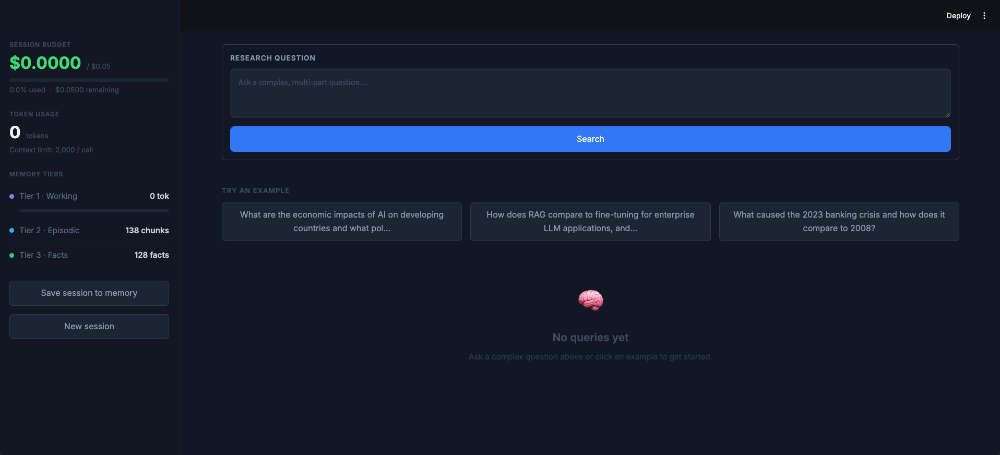
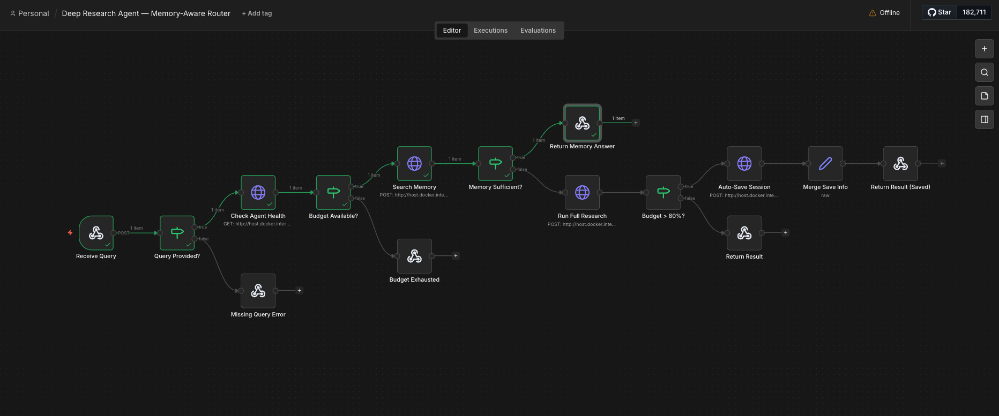

# Deep Research Agent

Most agents ignore cost. This one enforces a **$0.05/session budget** and builds memory over time — so repeated queries get cheaper and faster without sacrificing answer quality.

A memory-constrained AI research agent that answers complex, multi-part questions by checking its own memory before searching the web — all within strict token and cost budgets.

Built with **Claude** (Anthropic) for reasoning, **ChromaDB** for vector memory, **Tavily** for web search, **FastAPI** as the backend, and **n8n** for workflow orchestration.

> For architecture trade-offs, constraint decisions, and business impact analysis, see [evaluation.md](evaluation.md).

---

## How It Works

```
User Query
     │
     ▼
┌────────────────────────────────────────────────────────────┐
│               n8n Workflow (Orchestration)                 │
│                                                            │
│  Webhook ─→ Validate ─→ Health Check ─→ Budget Gate        │
│                                            │               │
│                                            ▼               │
│                                     Search Memory          │
│                                      (zero cost)           │
│                                            │               │
│                                            ▼               │
│                                   Memory Sufficient?       │
│                                (score ≥ 0.40, ≥ 2 chunks)  │
│                                   /              \         │
│                                  /                \        │
│                           YES: Return       NO: Full       │
│                           Memory Answer     Research       │
│                                                │           │
│                                                ▼           │
│                                         Budget > 80%?      │
│                                          /        \        │
│                                         /          \       │
│                                  Auto-Save     Return      │
│                                  Session       Result      │
└────────────────────────────────────────────────────────────┘
                              │
                              ▼
┌────────────────────────────────────────────────────────────┐
│                  Full Research Pipeline                    │
│                                                            │
│  1. Decompose query ─→ 2–4 sub-questions  (Claude Haiku)   │
│  2. For each sub-question, Claude decides:                 │
│       query_memory ─→ 3-tier memory (working + ChromaDB)   │
│       web_search   ─→ Tavily (max 3/query, budget-gated)   │
│  3. Context Assembler packs results within 2K token limit  │
│  4. Synthesise final answer  (Claude Sonnet)               │
│  5. Extract facts ─→ store in ChromaDB for future queries  │
└────────────────────────────────────────────────────────────┘
```

### Memory Tiers

| Tier | What | Storage | Constraint |
|------|------|---------|------------|
| 1 — Working | Last 5 conversation turns | In-process (Python deque) | 800 token cap, FIFO eviction |
| 2 — Episodic | Session summaries | ChromaDB (cosine similarity) | Stored at session end |
| 3 — Semantic | Extracted facts (3–5 per answer) | ChromaDB (cosine similarity) | Best-effort, never blocks main flow |

### Self-Imposed Constraints

| Constraint | Value | Why |
|-----------|-------|-----|
| Context tokens per LLM call | 2,000 | Forces selective retrieval over dumping everything in |
| Session cost budget | $0.05 | Simulates real per-user cost limits |
| Web searches per query | 3 | Forces memory reuse; cost drops as memory grows |
| Working memory turns | 5 | Prevents unbounded context growth |

---

## Quick Start

### Prerequisites

- Python 3.12+
- Docker (for n8n)
- API keys: [Anthropic](https://console.anthropic.com) + [Tavily](https://tavily.com) (free tier available)

### 1. Install

```bash
git clone <repo-url>
cd deep-research-agent
python -m venv venv
source venv/bin/activate   # Windows: venv\Scripts\activate
pip install -r requirements.txt
```

### 2. Configure

```bash
cp .env.example .env
```

Edit `.env` and add your keys:

```
ANTHROPIC_API_KEY=sk-ant-...
TAVILY_API_KEY=tvly-...
```

### 3. Start the FastAPI server

```bash
uvicorn api.main:app --reload --port 8000
```

Verify: `curl http://localhost:8000/health` should return `{"status": "ok", ...}`

API docs: http://localhost:8000/docs

### 4. Start n8n and import the workflow

```bash
docker run -it --rm --name n8n -p 5678:5678 -v ~/.n8n:/home/node/.n8n n8nio/n8n
```

Then:
1. Open http://localhost:5678
2. **Workflows → Import from file** → select `n8n_workflow.json`
3. Save the workflow (Ctrl/Cmd+S)
4. Activate the workflow (toggle in top-right)

### 5. Test it

```bash
curl -X POST http://localhost:5678/webhook/research \
  -H "Content-Type: application/json" \
  -d '{"query": "What caused the 2008 financial crisis?"}' \
  --max-time 120
```

First query goes through the full research pipeline. Ask the same question again — n8n's memory-first routing returns the answer from memory without any LLM cost.

### 6. (Optional) Streamlit UI

```bash
streamlit run ui/app.py
```

Opens a visual dashboard at http://localhost:8501 with live budget tracking, memory stats, and reasoning traces.



### 7. Run tests

```bash
pytest tests/ -v
```

4 test modules cover budget tracking (thread safety), working memory eviction, context assembly (token budget), and query decomposition.

---

## n8n Workflow



The n8n workflow handles **query routing** and **memory management** — the two responsibilities the orchestration layer is responsible for.

### Routing logic (15 nodes)

| Step | Node | What it does |
|------|------|-------------|
| 1 | Receive Query | Webhook receives `{ "query": "..." }` |
| 2 | Query Provided? | Rejects empty queries (400) |
| 3 | Check Agent Health | `GET /health` — reads budget + memory state |
| 4 | Budget Available? | Rejects if session cost ≥ $0.05 (402) |
| 5 | Search Memory | `POST /memory/search` — ChromaDB vector lookup (zero cost) |
| 6 | Memory Sufficient? | Score ≥ 0.40 AND ≥ 2 chunks? |
| 7a | Return Memory Answer | Yes → respond from memory (no LLM cost) |
| 7b | Run Full Research | No → `POST /query` (full agent pipeline) |
| 8 | Budget > 80%? | After research, checks if cost ≥ $0.04 |
| 9 | Auto-Save Session | Yes → `POST /session/end` (persists memory before budget runs out) |
| 10 | Return Result | Sends final JSON response |

### API endpoints

| Endpoint | Method | Purpose |
|----------|--------|---------|
| `/health` | GET | Agent status, budget, memory count |
| `/memory/search` | POST | Pre-query memory lookup for n8n routing |
| `/memory/stats` | GET | Detailed memory tier breakdown |
| `/query` | POST | Full research pipeline |
| `/session/end` | POST | Save session to memory, reset agent |

> **Note:** The workflow uses `host.docker.internal:8000` (Docker's alias for the host machine). If running n8n natively (not in Docker), replace with `127.0.0.1:8000` in each HTTP Request node.

---

## Project Structure

```
deep-research-agent/
├── agent/
│   ├── agent.py               # Main orchestration: decompose → tools → synthesise
│   ├── decomposer.py          # Splits complex queries into sub-questions
│   ├── context_assembler.py   # Packs retrieved chunks within token budget
│   ├── budget.py              # Thread-safe token counter + cost tracker
│   ├── config.py              # All constants and tuneable parameters
│   ├── utils.py               # Logging + JSON parsing helpers
│   ├── memory/
│   │   ├── working.py         # Tier 1: sliding window buffer
│   │   └── episodic.py        # Tier 2+3: ChromaDB vector store
│   └── tools/
│       └── search.py          # Tavily web search wrapper
├── api/
│   └── main.py                # FastAPI server (5 endpoints)
├── ui/
│   └── app.py                 # Streamlit dashboard (optional)
├── tests/
│   ├── test_budget.py
│   ├── test_working_memory.py
│   ├── test_context_assembler.py
│   └── test_decomposer.py
├── n8n_workflow.json           # Importable n8n workflow (15 nodes)
├── evaluation.md               # Architecture trade-off analysis
├── requirements.txt
├── .env.example
└── .gitignore
```

---

## Example Queries

```
"What are the economic impacts of AI on developing countries and what policies are being proposed?"

"How does RAG compare to fine-tuning for enterprise LLM applications, and when should each be used?"

"What caused the 2023 banking crisis and how does it compare to 2008?"
```

---

## Tech Stack

| Layer | Technology |
|-------|-----------|
| LLM | Claude Haiku 4.5 (fast tasks) + Claude Sonnet 4.6 (synthesis) |
| Web Search | Tavily |
| Vector Memory | ChromaDB (cosine similarity) |
| Token Counting | tiktoken |
| API | FastAPI + Uvicorn |
| UI | Streamlit |
| Orchestration | n8n (Docker) |
| Tests | pytest |
